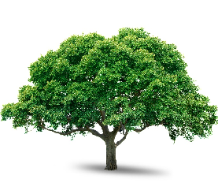

# Opencv Test

Install [opencv](https://docs.opencv.org/trunk/d7/d9f/tutorial_linux_install.html)

Install [cargo](https://www.rust-lang.org/tools/install)
 
## Clone project
 ```sh
 git clone https://github.com/renatomoitinho/opencv-test.git
 ```
## Build and create lib
```sh
cd opencv-test
RUSTFLAGS="-C target-feature=-crt-static $(pkg-config opencv --libs)" cargo install --jobs 2 --path .
```
## run from anywhere :)
 ```sh
$ opencv-test /home/renato/Pictures/image.jpeg 800
time to read image from buffer alpha=false w=Ok(700) h=Ok(700) time=7.84477ms
time to resize w=Ok(800) h=Ok(800) time=2.799397ms
time to read buffer size=89492 time=3.843157ms
total time 14.526851ms
 ```
## Actions
1. Load Matriz
2. Generate thumbnails
3. Expand 
4. Convert PNG transparent to white pixels
5. Compress in JPG

>    

>  

# Benchmark
## Opencv rust
> [Lib](https://opencv.org/)

> [Code in rust](https://github.com/renatomoitinho/opencv-test/blob/master/src/main.rs)

> [Crates](https://crates.io/crates/opencv)

|input bytes| width x height| input format | output format | resize  | output bytes | time
|--|--|--|--|--|--|--
| 5.7MB | 4000x6000 | PNG | JPG | 1080x1080| 87.3Kb | 675ms
| 529Kb | 789x789 | PNG | JPG | 700x700| 75.9Kb|37.5ms
| 3.3MB | 2000x1614 | PNG | JPG | 1080x1080 |285Kb| 175.4ms 
| 190.6Kb | 500x500 | PNG | JPG | 400x400 |39.8Kb | 15.5ms
||||||488Kb|903.4ms

## Libvips rust
> [Lib](https://github.com/libvips/libvips)

> [Code in rust](https://github.com/renatomoitinho/vips-test/blob/master/src/main.rs)

> [Crates](https://crates.io/crates/libvips)

|input bytes| width x height| input format | output format | resize  | output bytes | time (ms)
|--|--|--|--|--|--|--
| 5.7MB | 4000x6000 | PNG | JPG | 1080x1080| 54.8Kb | 1.13s
| 529Kb | 789x789 | PNG | JPG | 700x700| 50.6Kb| 88ms
| 3.3MB | 2000x1614 | PNG | JPG | 1080x1080 |190.6Kb| 310ms 
| 190.6Kb | 500x500 | PNG | JPG | 400x400 |27.8Kb | 43.6ms
||||||323.8Kb|1.57s

## Imagemagick (converter)
> [Lib](https://www.imagemagick.org)

> [code](https://imagemagick.org/script/convert.php)

|input bytes| width x height| input format | output format | resize  | output bytes | time (ms)
|--|--|--|--|--|--|--
| 5.7MB | 4000x6000 | PNG | JPG | 1080x1080| 67.7Kb | 3,4s
| 529Kb | 789x789 | PNG | JPG | 700x700| 58.4Kb| 433ms
| 3.3MB | 2000x1614 | PNG | JPG | 1080x1080 |257.7Kb| 1,09s 
| 190.6Kb | 500x500 | PNG | JPG | 400x400 |35.6Kb | 191ms
||||||419.4Kb|5.11s

## So info

**Ubuntu 18.04.4 LTS**

**memory:** 15,4 GiB

**processor:** Intel® Core™ i7-6500U CPU @ 2.50GHz × 4 

**Graphics:** Intel® HD Graphics 520 (Skylake GT2)

**Os type:** 64-bit
